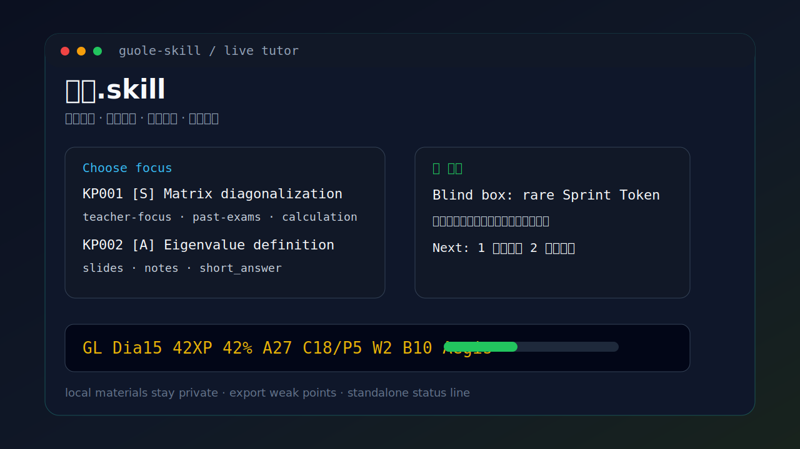

# 过了.skill

> 一个还在测试中的备考 Skill：把你自己的课件、真题、老师重点和笔记，变成考点清单、一题一答、错题反馈和复习建议。



目前是原型版，欢迎试用、提 issue、PR 或建议。

## 安装

Claude Code 全局安装：

```cmd
git clone https://github.com/dongzikai666/guole-skill.git "%USERPROFILE%\.claude\skills\guole"
```

当前项目安装：

```cmd
git clone https://github.com/dongzikai666/guole-skill.git ".claude\skills\guole"
```

安装后重启 Claude Code，在对话里输入：

```text
/guole
```

Codex / 其他 Agent 可用 `$skill-installer` 安装：

```text
使用 $skill-installer 从 https://github.com/dongzikai666/guole-skill 安装这个 skill。
```

`/guole` 是 Claude Code slash command，`$guole` 是 Agent 对话触发词；它们不是 CMD / PowerShell 命令。这里的 `guole` 是“过了”的拼音入口，不是另一个中文品牌名。

## 使用

可用入口只有两个：

| 入口 | 用途 |
| --- | --- |
| `/guole` | Claude Code 中启动过了.skill |
| `$guole` | Codex / Agent 中触发过了.skill |

进入后直接用自然语言说你要做什么：

```text
帮我初始化课程空间。
进入记忆模式，先背老师划的重点。
查看我的掌握度和考试风险。
导出错题和薄弱点。
帮我启用状态栏。
```

如果 Claude Code 已自动显示底部状态栏，就不用额外配置；如果没有，在 `/guole` 对话里说“帮我启用状态栏”。

## 示例

启动并初始化：

```text
你：/guole
过了.skill：检测到还没有课程空间。请告诉我课程名、考试时间、目标分数，并把资料放到对应文件夹。
```

选择考点后开始刷题：

```text
你：/guole
过了.skill：
Top 考点
KP001 矩阵秩与线性方程组｜高优先级｜来自 teacher-focus + past-exams
KP002 特征值与对角化｜高优先级｜来自 syllabus + slides
KP003 正交投影｜中优先级｜来自 homework

回 KP 编号开始练习。
```

一题一答反馈：

```text
你：练 KP001，题型计算题，难度期末常规。
过了.skill：题目｜KP001｜计算题｜期末常规
已知 A 的行阶梯形矩阵如下……求 rank(A) 并判断 Ax=b 何时有解。

你：rank 是 2，b 要满足第三行对应条件。
过了.skill：✅ 正确｜+8 XP｜盲盒 rare +2 box_points
解释：秩看主元个数；有解条件看增广矩阵最后一行不能出现 0=非零。
口诀：主元数秩定高低，零行撞非零就无解。
下一步：1 同类巩固｜2 下个考点｜3 看报告｜0 返回重选
```

记忆模式：

```text
你：进入记忆模式，先背老师划的重点。
过了.skill：记忆卡｜KP002 特征值与对角化
通俗解释：对角化就是把复杂矩阵换成更好算的“坐标版本”。
口诀：特征向量凑满屋，对角化才有路。
回忆提示：请你不看资料，说出矩阵可对角化的一个常见判定条件。
```

状态栏示例：

```text
GL Dia15 42XP 42% A27 C18/P5 W2 B10 Aegis
```

报告示例：

```text
预计区间：62-74
通过风险：中
最可能丢分：KP002 对角化条件、WP003 计算符号错误
下一步：先做 3 道 KP002 基础题，再做 1 道真题模拟。
```

## 资料目录

首次使用时，`/guole` 会帮你创建本地课程空间：

```text
exam-coach-workspace/
  subjects/
    linear-algebra/
      materials/
        syllabus/
        teacher-focus/
        past-exams/
        slides/
        notes/
        homework/
        user-mistakes/
```

各目录放什么：

| 文件夹 | 内容 |
| --- | --- |
| `syllabus/` | 课程大纲、考试范围、题型说明 |
| `teacher-focus/` | 老师划重点、考前提示，优先级最高 |
| `past-exams/` | 历年真题、样卷、回忆版题目 |
| `slides/` | PPT、课件、课堂讲义 |
| `notes/` | 自己整理的笔记、知识点总结 |
| `homework/` | 作业、习题、实验题、平时训练材料 |
| `user-mistakes/` | 自己做错的题、不会的题、薄弱点记录 |

可选目录：`textbook-excerpts/` 放少量教材摘录，`past-exam-answers/` 放你有权使用的真题答案，`public-links/` 放公开课程、公开视频或公开文档链接。

## 能做什么

- 根据资料生成重难点清单，让你先选考点再刷题。
- 一题一答：出题、等你答、判题、解释、记录进度。
- 错题后自动标记薄弱点，并建议同类巩固题。
- 支持记忆模式、错题导出、考试准备度评估。
- 有 XP、段位、伙伴、盲盒和 Claude Code 状态栏反馈。

## 游戏化

| 机制 | 说明 |
| --- | --- |
| XP / 段位 | Bronze -> Silver -> Gold -> Platinum -> Diamond -> Master -> King -> Legend |
| 伙伴 | Ember -> Pulse -> Nova -> Vanguard -> Aegis -> Mythic |
| 盲盒 | 答对后给 `bonus_xp` 和 `box_points` |
| 解锁 | 弱点攻坚、真题模拟、Boss 综合题 |

游戏化只做激励，不改变真实掌握度判断。

## 项目结构

```text
guole-skill/
  SKILL.md
  agents/
  references/
  scripts/
  assets/
```

用户资料和学习记录只生成在本地 `exam-coach-workspace/`，不要提交到公开仓库。

## 注意

- 这是原型版，还在测试中。
- 不保证押中原题，也不保证通过考试。
- 不要公开上传课程 PPT、老师课件、教材扫描、真题、答案或同学笔记。
- 联网搜索只在用户明确允许时使用，并应引用公开来源。

## License

MIT License.
