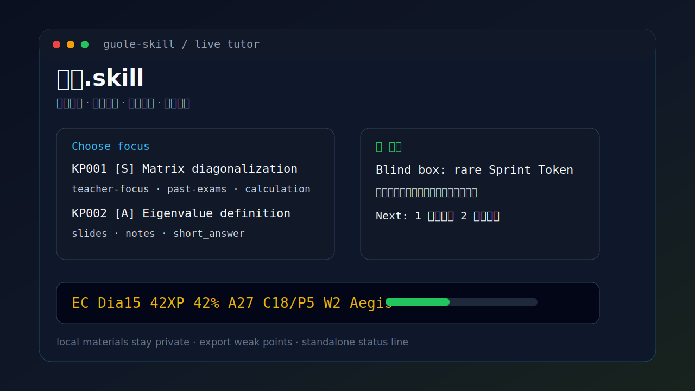

# 过了.skill

> 一个用于短期突击复习的 Agent Skill：根据你自己的课程资料，生成考点清单，并进入一题一答的实时备考模式。



目前还在测试中，是一个原型版 Skill。有兴趣的小伙伴可以试试，也欢迎提 issue / PR / 建议。

`过了.skill` 不内置任何课程资料、真题、课件或答案。它只提供一套学习流程和本地脚本，帮助你把自己的资料变成考点清单、刷题反馈、错题记录和复习建议。

## 安装

### Claude Code: Windows CMD

```cmd
git clone https://github.com/dongzikai666/guole-skill.git
if not exist "%USERPROFILE%\.claude\skills" mkdir "%USERPROFILE%\.claude\skills"
xcopy /E /I /Y "guole-skill\exam-study-coach" "%USERPROFILE%\.claude\skills\exam-study-coach"
```

可选：启用 Claude Code 底部状态栏。

```cmd
python "%USERPROFILE%\.claude\skills\exam-study-coach\scripts\setup_statusline.py" --mode standalone --claude-dir "%USERPROFILE%\.claude" --skill-dir "%USERPROFILE%\.claude\skills\exam-study-coach"
```

重启 Claude Code 后，在对话框里输入：

```text
$guole
```

注意：`$guole`、`$exam-study-coach` 是 Agent 对话触发词，不是 PowerShell / CMD 命令。

### Codex / Agent

如果你的 Agent 环境支持 `$skill-installer`，可以在 Agent 对话里输入：

```text
使用 $skill-installer 从 https://github.com/dongzikai666/guole-skill/tree/main/exam-study-coach 安装这个 skill。
```

安装后重启 Codex / Agent 以加载新 Skill。

## 使用

初始化一门课：

```cmd
python "%USERPROFILE%\.claude\skills\exam-study-coach\scripts\init_subject.py" --title "Linear Algebra"
```

把资料放进生成的本地目录：

```text
exam-coach-workspace/
  subjects/
    linear-algebra/
      materials/
        syllabus/
        teacher-focus/
        past-exams/
        slides/
        notes/
        homework/
        user-mistakes/
```

然后在 Agent 对话里输入：

```text
$guole
```

常用说法：

```text
根据我的资料生成考点清单。
练 KP001，题型用计算题，难度期末常规。
进入记忆模式，先帮我背老师划的重点。
评估一下我现在大概能考多少，最可能丢分在哪里。
导出我的错题和薄弱点。
```

## 能做什么

- 初始化课程空间和资料分区。
- 按老师重点、考试范围、真题风格、错题记录生成考点清单。
- 一题一答：出一题、等你答、判一题、讲一题。
- 支持记忆模式：知识点卡片、口诀、回忆自测。
- 记录错题、薄弱点、掌握度和考试准备度。
- 可导出错题 Markdown，环境支持时也可导出 PDF。
- 可选 Claude Code 彩色状态栏。

## 游戏化反馈

游戏化只做激励，不改变真实掌握度判断。

| 机制 | 规则 |
| --- | --- |
| XP | 答对给 XP，半对给部分 XP，错题记录错因给 reflection XP |
| 段位 | Bronze -> Silver -> Gold -> Platinum -> Diamond -> Master -> King -> Legend |
| 伙伴 | Ember -> Pulse -> Nova -> Vanguard -> Aegis -> Mythic |
| 盲盒 | 答对题后开启，获得 `bonus_xp` 和 `box_points` |
| 解锁 | 记忆模式、弱点攻坚、真题模拟、Boss 综合题 |

状态栏示例：

```text
EC Dia15 42XP 42% A27 C18/P5 W2 B10 Aegis
```

含义：Diamond Lv15、本级 42 XP、已答 27、正确 18、半对 5、弱点 2、盲盒积分 10、伙伴 Aegis。

## 目录结构

```text
exam-study-coach/
  SKILL.md
  agents/
  references/
  scripts/
  assets/
```

用户资料和学习进度会生成在本地 `exam-coach-workspace/`，不属于本仓库内容。

## 注意事项

- 这是原型版，还在测试中。
- 不保证押中原题，也不保证通过考试。
- 不要把课程 PPT、老师课件、教材扫描、真题、答案或同学笔记提交到公开仓库。
- 联网搜索只在用户明确允许时使用，并应引用公开来源。
- 发布或二次开发时请继续忽略 `study-pack/`、`exam-coach-workspace/`、`__pycache__/` 和 `*.pyc`。

## License

MIT License.

本仓库只包含 Skill 流程、脚本和模板，不包含任何课程资料、真题、答案或老师课件。
